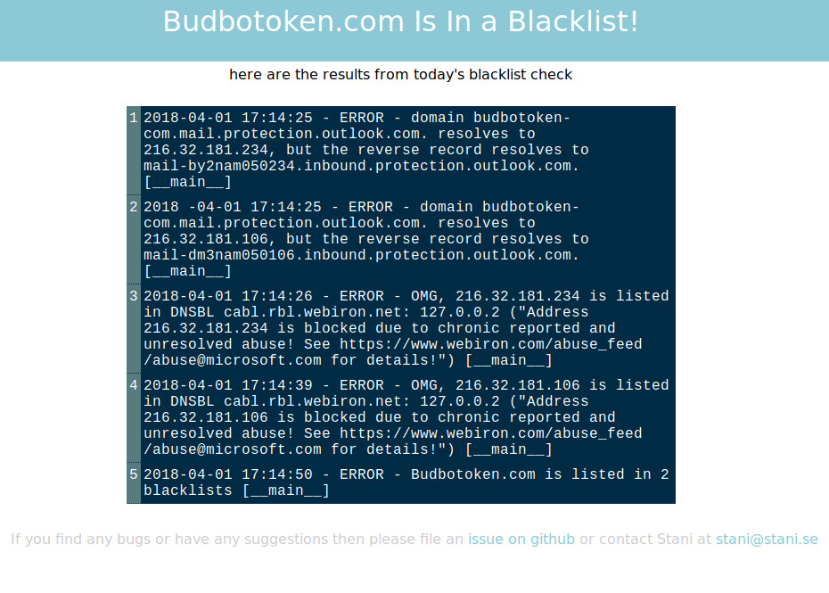

# Nix Blacklist Monitor

This is a simple blacklist monitor for servers running NixOS. It uses Georg Sauthoff's `check-dnbl.py` script [(repo)](https://github.com/gsauthof/utility) to check if one of your domains is in a blacklist, and if it then it will automatically send you a nice looking email telling you about it:



_(I am in no way affiliated with the domain mentioned in the email, I was just using it for testing)_


# Usage

* clone the repo
* add this to your nix configuration:
  ```
  imports = [ /path/to/repo/default.nix ]
  checkDnsBL = {
    enable = true;
    addresses = [ "example.com" "xxx.xxx.xxx.xxx" ] # add all the domains and IPs that you want to check.
    mailTo = [ "your@email.com" "someone@else.com" ] # all emails that should receive an email if one of your addresses happens to appear in a blacklist
  }
  ```

Feel free to send me an email or open an issue if you have any questions.

